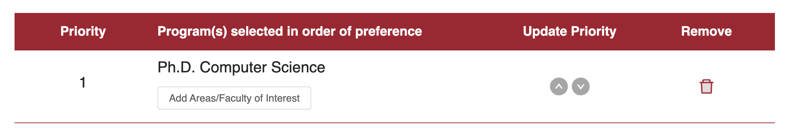
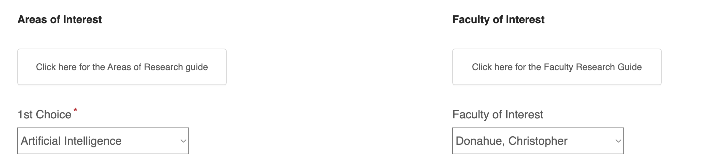

===
title: "Apply"
===

# Applying to G-CLef

## About G-CLef

We are the [**Generative Creativity Lab (G-CLef)**](./README.md) in the Computer Science Department (CSD) at Carnegie Mellon University. Our mission is to _empower and enrich human creativity with generative AI_. We focus primarily on the intersection of _music and AI_, though we also work on other applications such as code, gaming, and language. Our current research interests can be found [below](#research-interests). The G-CLef lab is led by [Chris Donahue](https://chrisdonahue.com), Dannenberg Assistant Professor at CMU CSD.

## Applying

Please view the specific instructions for [PhD applicants](#phd-applicants) and for [other applicants](#other-applicants). For PhD applicants, CSD will review applications once per year after they are due in December.

Note that we have limited bandwidth / funding in our lab and unfortunately do not have the resources to respond to all inquiries. You may email Chris directly about your application, though this will not guarantee a response. See [this FAQ from Yonatan Bisk at CMU LTI](https://talkingtorobots.com/FAQ.html) for some great general guidance on how/when to email professors and what to expect.

## PhD applicants

To apply for a PhD with the G-CLef lab for a **Fall 2026 start date**, please formally apply to the [CMU CSD PhD program by December 10, 2025](https://csd.cmu.edu/academics/doctoral/admissions), details below.

**Optionally**, feel free to submit our [lab-specific application form](https://forms.gle/H4Pq9ufJwgccJ8jN7) in advance of your official CSD PhD application. This is intended to be low effort relative to the official application, and is mainly used to ensure that we don't miss any official applications from students who are particularly interested in G-CLef. Your official application will be reviewed equally regardless of if you submit this lab-specific form.

Note that PhD admissions decisions are ultimately made by the CSD PhD admissions committee, not by individual G-CLef lab members.

### Formally applying to the CMU CSD PhD program

**Apply via the main [CMU School of Computer Science PhD application](https://csd.cmu.edu/academics/doctoral/admissions) by December 10th 2025!**

**Note**: The following instructions have not yet been updated for the 2025-2026 application cycle, and the instructions below may be out of date.

At CMU, the School of Computer Science (SCS) has many departments, one of which is (somewhat confusingly) named the Computer Science Department (CSD). I am affiliated w/ CSD, so **make sure to apply to CSD via the "Ph.D. Computer Science"** option to ensure your application will be routed properly.

Also, click on "Add Areas/Faculty of Interest" and add either "Artificial Intelligence" or "Machine Learning" as your 1st choice, and "Donahue, Christopher" as a faculty of interest.

## Other applicants

For non-PhD applicants (postdoc, CMU masters / undergrad, visitors), please apply using [this form](https://docs.google.com/forms/d/1DI4dAG_zp6HmbJx_0rxqWJYU3XEIzGUQTXXJNcuZiKc/edit). For CMU students, I typically only work with students who have taken and done well in my _Intro to Computer Music_ course (15322 for undergrads, 15622 for grads) or my graduate music AI seminar (15798), though there are occasional exceptions to this.

## Research interests

Generative AI is rapidly changing the landscape of music both commercially and culturally (see [this recent talk](https://docs.google.com/presentation/d/1Zh7NO7TeDtd95i3eemWOa5Y3w1cvXOk18_LoQrUgLSA/edit?usp=sharing) for detailed arguments). Accordingly, our lab is increasingly pursuing a goal of _holistic research in generative music AI_, encompassing not only the core ML problems, but also an emerging class of HCI and broader sociotechnical challenges. A few research questions we're pursuing:

- RQ1: How can we augment music generation models with multimodal control mechanisms that better support the human creative process?
- RQ2: Can we unlock real-time interaction with music generation models?
- RQ3: How might we _integrate_ generative AI into interactive creative workflows or new context-sensitive music applications?
- RQ4: How can we _evaluate_ generative AI at scale and within interactive workflow scenarios?
- RQ5: Can we better understand the relationships between training data and generative model outputs in pursuit of sustainable and equitable economic models?

A few of our recent and ongoing projects:

- (RQ1) [Music ControlNet](https://arxiv.org/abs/2311.07069) (TASLP '24) and [SingSong](https://arxiv.org/abs/2301.12662), improving time-varying control precision for music generation
- (RQ1) [Anticipatory Music Transformer](https://crfm.stanford.edu/2023/06/16/anticipatory-music-transformer.html) (TMLR '24), symbolic music generation with flexible co-creation capabilities
- (RQ1) [Aligning sheet music images and performance recordings](https://www.youtube.com/watch?v=t7YqPhx2qUg&list=PLW0czm0ADbujBhwidr1Tya2Z4KI-d96_I) (ISMIR '24), understanding multimodal relationships in music
- (RQ2) [Infinite Music Player](https://rickzx.github.io/inf-music/) (ISMIR LBD '24), real-time on-device symbolic music generation in your browser
- (RQ3) [Hookpad Aria](https://www.hooktheory.com/hookpad/aria) (ISMIR LBD '24), a Copilot for pop songwriters based on the Anticipatory Music Transformer
- (RQ3) [GUI agents](https://arxiv.org/abs/2409.12089) (NeurIPS Open-World Agents Workshop '24), enabling LLM agents to operate on GUIs
- (RQ3) [Music-aware virtual assisants](https://dl.acm.org/doi/pdf/10.1145/3654777.3676416) (UIST '24), what if Google Maps could sing to you?
- (RQ4) [Copilot Arena](https://github.com/lmarena/copilot-arena), evaluating Copilot coding assistants in-the-wild

(Chris) Note that I may have an implicit bias against applications that parrot these research interests to me verbatim. I prefer to see your original ideas alongside a high-level understanding of how they relate to our lab's work and broader goals.

## Additional resources

- [Somewhat out of date research statement](./2024%20Research%20Statement.pdf) from Spring 2024.
